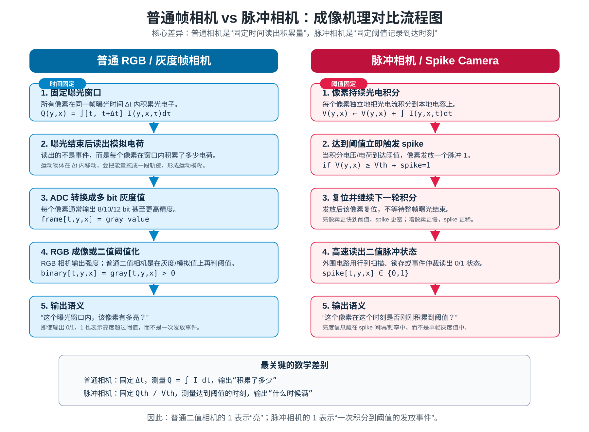
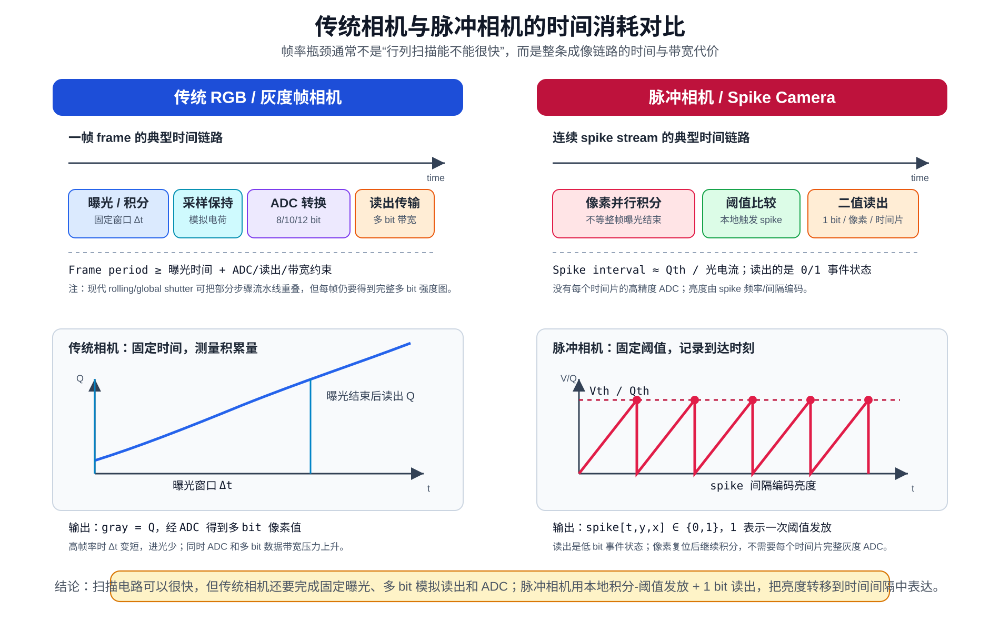
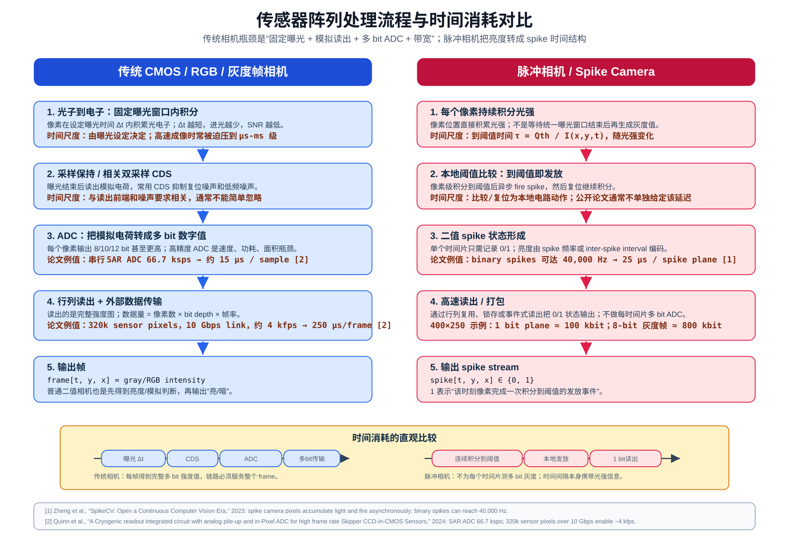

# SNN / Spike Camera Notes

This repository collects conceptual diagrams and notes about spike cameras
and their difference from conventional frame cameras.

## Core Idea

普通相机和脉冲相机都利用光电转换，但二者的信息编码方式不同。

普通相机：

```text
固定曝光时间 -> 积累光电子 -> 读出模拟电荷 -> ADC -> 多 bit 灰度/RGB 图像
```

脉冲相机：

```text
像素持续积分 -> 到达阈值 -> 发放 spike -> 复位继续积分 -> 输出 0/1 脉冲流
```

因此，普通二值相机的 `1` 表示“这个曝光窗口内亮度超过阈值”，而脉冲相机的
`1` 表示“这个像素在该时刻完成了一次积分到阈值的发放事件”。

## Figures

### 1. Imaging Principle Comparison



This figure compares the imaging pipeline of a conventional RGB/grayscale
camera and a spike camera.

### 2. Timing Cost Comparison



This figure explains why the frame-rate bottleneck of conventional cameras is
not only row/column scanning speed. The complete imaging chain includes fixed
exposure, analog readout, ADC conversion, and multi-bit data transfer.

### 3. Sensor Array Timing Flow



This figure compares the processing steps inside a conventional image sensor
array and a spike camera array, with representative timing values from
academic literature.

## Short Summary

```text
Conventional camera:
  fixed time window, measure accumulated charge.

Spike camera:
  fixed threshold, record when accumulation reaches the threshold.
```

In other words:

```text
Conventional camera = "how much light was accumulated during this exposure?"
Spike camera        = "when did this pixel accumulate enough light to fire?"
```
